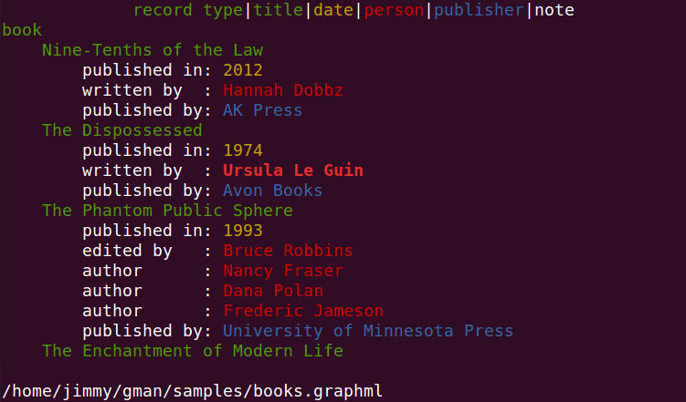
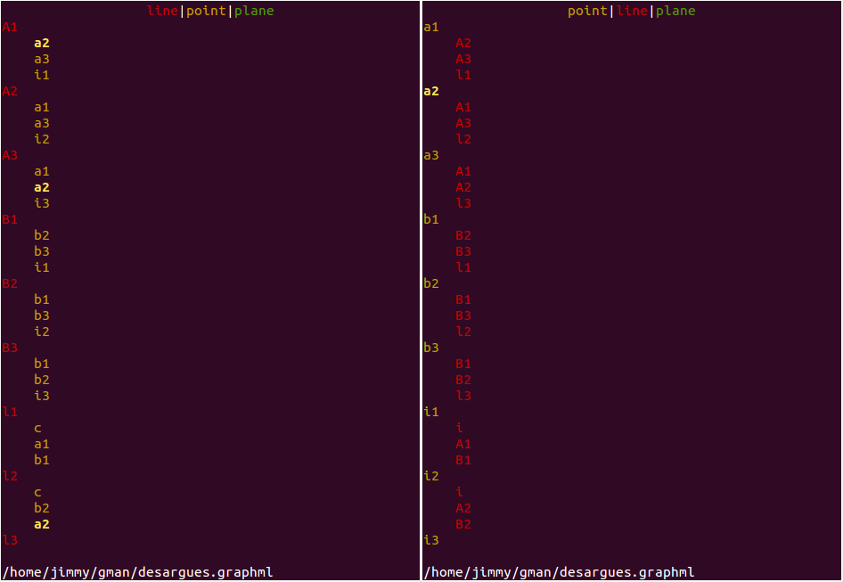
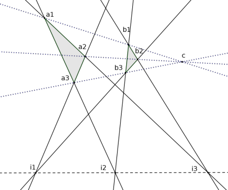
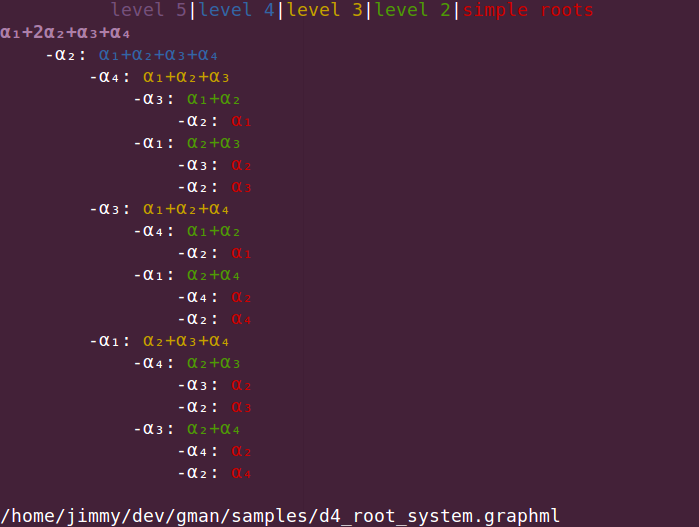

*This program is still in early development*

`gman` is a lightweight `ncurses`-based text-mode tool for navigating and annotating a mathematical graph, also known as a network. For example, notes for a project, references for an article--or syntax trees, Hasse diagrams, Cayley graphs, ... .

Originally, I started writing this program because I wanted a minimalist personal wiki for organizing notes and references. The other programs I found were too mouse-driven, toolbar-loaded, or application-specific, and I wanted something simpler than Emacs Org-mode.

(Illustration of Desargues configuration, c/o [Geogebra](http://geogebra.org))

[(Type D4 root system, for so(8) Lie algebra)](https://commons.wikimedia.org/wiki/Category:Root_system_Hasse_diagrams#/media/File:D4Hasse.svg)

How it works
------------

The program works best for data possessing a mutable hierarchy.

The nodes (fields) of your graph belong to disjoint categories. You choose an ordering of the categories and an ordering of the nodes in each category to build a "tree view" into the data.

You can edit fields and category names, add new ones, and link up related nodes.

Get started
-----------

You'll probably need to be running Linux, but Mac support should be forthcoming (and even Windows, especially if Microsoft delivers on their promise to bundle a native terminal emulator with the new OS). The only library dependency is `ncursesw`. The [GraphML](http://graphml.graphdrawing.org/) implementation is based on [PugiXML](http://pugixml.org/) (thanks to Arseny Kapoulkine), with the source provided here.

Instructions:

    git clone http://github.com/jimmymathews/gman
    cd gman/
    cmake .
    make
    ./gman

For the above you'll need `git`. You'll also need `cmake` and make tools. Its a fairly primitive use of `cmake`, so you could instead compile it yourself with something like

    g++ third_party_modules/pugixml/pugixml.cpp source/data/database_manager.cpp source/gui/screen_handler.cpp source/key_handling/key_handler.cpp source/gui/category_bar.cpp source/gui/category_tile.cpp source/data_interaction/tree_viewer.cpp source/Main.cpp -Iinclude -Ithird_party_modules/pugixml -Ikey_registration_module/include -std=c++11 -lncursesw -o gman

Since every terminal emulator handles keys differently, a little key-setup program runs the first time `gman` is run. (Actually it works as a self-contained module for mediating keystrokes, which you could easily use in your own `ncurses` projects.)

If you make a mistake in the configuration, remove the configuration file `.mk_keys` that it makes in your home directory and it will run again.

Controls
--------

Basic

- **Ctrl-Up/Down**. Go down to the fields / up to the categories
- **Ctrl-s**. Save to `.graphml` file 
- **Ctrl-o**. Open `.graphml` file
- **Esc-Esc**. Exit

Main window

- **Left/Right/Up/Down**. Navigation
- **Shift-Up/Down**. Swap fields in the same category
- **Shift-Left/Right**. Expand or collapse the tree view; selection if editing field contents
- **Enter**. Start/stop editing a field with small editor
- **Ctrl-e**. Start editing a field in larger editor. **Enter** allowed here to make new lines.
- **Delete**. Delete field
- **Home/End**. Navigation if editing field contents
- **Ctrl-c**. Copy selection
- **Ctrl-v**. Paste selection
- **Ctrl-g**. Initiate a greek character (upper or lower case)
- **Ctrl-r**. Toggle relation description display
- **^**. Initiate a superscript numeral
- **_**. Initiate a subscript numeral
- **`n`**. New node linked to chosen node (select a category then *Enter* to start entering contents)
- **`l`** then **`t`**.  **L**ink the current node **t**o another node; repeat **t** to link more nodes. **Enter** to stop linking
- **`u`**.  Unlink the current node from its parent

Category bar

- **Left/Right**. Navigation
- **Shift-Left/Right**. Swap categories
- **Enter**. Start/stop editing a category
- **Delete**. Delete category (and all of its fields)
- **`n`**. New node belonging to chosen category, initially unlinked to any other node
- **`a`**. Add new category
- **`c`**. Change the color of the fields in the selected category
- **Space**. Hide/unhide the fields of the selected category

Relation names

To add a description of the relationship between two linked nodes (to label an edge of the graph), prepend to the target node contents something like `some-relation-description: ` (the last two characters are a colon and space).

Development
-----------

If you'd like, consider reporting bugs (there are plenty), sharing recommendations, or writing new features:

- Simple bars indicating child nodes
- Search/replace function
- All-nodes view
- Filename tab completion
- Fix field editor page overflow
- "Pruning" operations; find graph-distance neighborhoods 
- Merge graphs from file
- Mac/Windows support 
- Export to BibTex
- Export to plain text
- Figure out `ncurses` colors to get more than 8 choices
- Create complete sub-graphs ("cliques") on ([small!](https://en.wikipedia.org/wiki/Factorial)) selections

